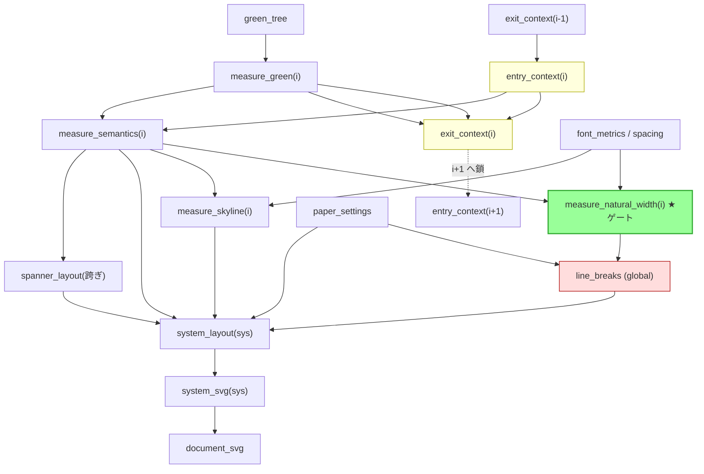
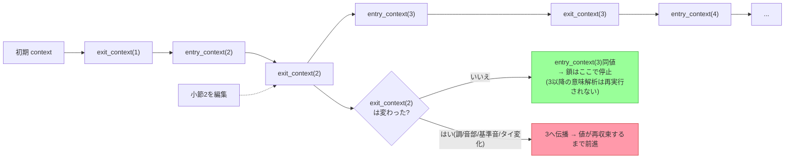
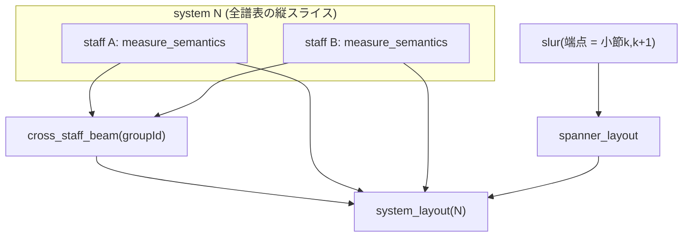
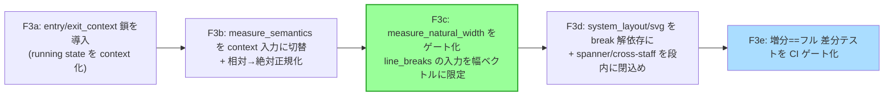

# Lily# F3 詳細設計：意味解析〜レイアウトのクエリ依存グラフ

> 作成日: 2026-06-29 / 親文書: `LSP_INCREMENTAL_IMPROVEMENT_PROPOSAL.md` の F3
> 性質: 設計提案。コード未編集。**前提は現行コードで要確認。**
> 狙い: Salsa 型の demand-driven メモ化クエリ DAG を、Lily# の音楽特有の長距離依存まで含めて実装可能な粒度で定義する。

---

## 0. 設計の中心アイデア（2つ）

1. **running state を連鎖クエリ `entry_context → exit_context` にする。**
   音楽は左→右に状態が流れる（調・音部・拍子・オッターヴァ・相対オクターブの基準音・小節を跨ぐタイ）。これを「各小節が**直前小節の exit_context だけに依存**する鎖」として表現する。全前方依存（=直列化）を避けつつ、**early cutoff で「状態が変わらなければ鎖が止まる」**を自動化する。

2. **`measure_natural_width` を行分割の唯一のゲートにする。**
   グローバルな Knuth-Plass 行分割の入力を「各小節の自然幅ベクトル」だけに絞る。幅を変えない編集（色・アーティキュレーション・運指・歌詞・スラー有無）は自然幅が不変 → 行分割クエリの入力ハッシュ同一 → **再分割をスキップ**。

---

## 0.5 現行コード検証と前提の修正（2026-06-29 夜、着手前の grounding）

本設計は当初「コード未編集・前提は現行コードで要確認」と断ってあった。着手にあたり 4 系統
（増分パース／意味解析／レイアウト／テスト基盤）を実コードで検証した。**設計の中核（context 鎖・
自然幅ゲート・spanner overlay）は妥当**だが、いくつかの前提が「無料で手に入る」かのように
書かれていた。実態に合わせて以下に訂正する。**実装はこの訂正を正とする。**

### ✅ 検証して成立した前提

- **臨時記号は barline 厳密ローカル**: `MeasureCollector` が `MeasureCompleted` コールバックで
  `_measureAccidentals` を毎小節 `Clear`（`MeasureCollector.cs:1264, 2123`、LILYPOND-REF
  accidental-engraver）。→ context が運ぶのは **key signature だけ**で良く、臨時記号状態は持ち越さない。設計どおり。
- **spanner / cross-staff は純 overlay で自然幅に寄与しない**: tie(`TieFormattingProblem.cs:76-100`)・
  slur(`SlurScoringProblem.cs:91-100`)・cross-staff(`CrossStaffEngraver.cs:65-91`、LayoutEngine 段階で
  spacing 後)はいずれも **post-spacing の X/Y を入力に取り、幅へフィードバックしない**。
  → §6「跨ぎは overlay／cross-staff は段内」は**既に真**。F3d は restructure でなく formalize。
- **`Measure` は immutable record**（`Measure.cs:46-174`、`SourceStart/SourceEnd` 付き）。
  entry/exit context を `init` プロパティで足す attach point として理想的。
- **cross-measure 依存集合は実在・列挙可能**: octave 鎖(`OctaveContext` の `CurrentOctave/LastPitchName`、
  barline でなく phrase/section reset)・key(`_keySharps`)・clef(`_clef`)・time・ottava・default duration・
  pending ties・open slurs/spanners・tab hand-position(`TabResolver.cs:166`)。Layer2 context の中身はこれで確定。

### ⚠️ 訂正が必要な前提（実装計画に影響）

1. **`measure_green(part,i)` は「無料の安定キー」ではない。**
   実態: 小節は green ノードでなく、`MeasureCollector` の walk が**事後に発見**する
   (`Measure` は意味層の record)。`GreenNode` に構造ハッシュ／`Equals` は無く、interning は
   token/trivia 層のみ(`GreenCache.cs`)。増分再利用も **top-level メンバ単位**のみ
   (`IncrementalReuseMap.cs`、`CompilationUnitGreen` の members)。
   → **F3a の最初の実務は「安定な per-measure 識別子の製造」**(小節 items の content hash か、
   green ハンドル＋reuse-map 照合)。設計が所与としていた部分が実は工数。

2. **「`measure_natural_width` を行分割のゲートにする」は構造的に既に成立済み。**
   実態: Knuth-Plass は**生の小節でなく per-measure の `MeasureSpringData[]`(ideal/min/stretch)を
   消費**している(`KnuthPlassBreaker.ComputeMeasureSpringData`、`SpacingRules.CalculateMeasureIdealWidth`
   `:61-81`)。ゲートは既に存在。**欠けているのは (a) 同じ自然幅が line-break と system-layout で
   2 回計算され cache されていないこと、(b) early-cutoff 比較が無いこと**だけ。
   → F3c は restructure でなく **memoization + cutoff の追加**。設計が示すより近い。

3. **tie / slur / 小節跨ぎ beam は walk 中でなく「声部全体の post-pass 前方スキャン」で解決される。**
   実態: `SlurDetector`(openSlurs スタック)・`TieDetector`(forward scan)・
   `BeamDetector.DetectCrossMeasureManualBeams` はいずれも collect 後の声部一括パス。
   → 設計の `pending_ties`/`open_spanners` を context に載せるだけでは足りず、**これら resolver 自体を
   per-measure 依存辺へ作り替える**必要がある。これは設計が過小評価していた cost。

4. **クエリ／メモ化エンジンも増分ドライバも、今は一切存在しない。**
   実態: Salsa 的 DAG・`Lazy<T>` メモ表・early-cutoff 機構は未実装(beam/slur scoring の PQ を除く)。
   かつ **F3 の効果は「メモ化エンジン」と「編集状態を跨いで保持する増分ドライバ(LSP)」の両方が
   揃って初めて出る**。純リファクタ部分(context 鎖・spring 重複除去)は安全で価値はあるが、
   **エンジン＋ドライバが来るまで速度向上はゼロ**。これを工程の前提に置く。

### 安全網は準備済み

`IncrementalParseTests.cs`(WithChange==full、300 編集 fuzz、green 再利用検証)が **F3e 差分テストの
そのまま使えるテンプレ**。e2e API は `SvgGenerator.Generate(tree)` / `BuildLayout(tree, spec)`。
benchmark は cold full＋stage 別(`RenderPipelineBenchmark`)はあるが**編集レイテンシ benchmark は無い**(F0 の穴)。

### この訂正を受けた実装順（§8 を上書き）

「安全・堅実・段階的マージ」方針。各段は**ビルド緑＋全テスト緑＋snapshot byte-identical**を確認して
から master へマージ。ブランチ `f3-incremental` で作業。

- **S0**(本節): 設計を検証済み前提に修正。コード不変。
- **S1**: F3e 差分ハーネス(`WithChange→full render == Parse(newText)→full render` を fuzz 保証、
  **テストのみ**)＋ F0 編集レイテンシ benchmark。本番コード不変。
- **S2 (= F3a)** ✅: `MeasureContext`(entry/exit) を **post-pass**(`MeasureContextChain`)で構築。
  `Measure` record にフィールド注入せず key+time backbone を fold。byte-identical 純追加。安定 per-measure
  識別子(訂正1)は未消費ゆえ S4 へ deferred。
- **S3 (= F3b)** ✅: **「レイアウト層を relative 非依存に」は現アーキで既に達成済み**と判明。
  `Svg/Layout` の相対オクターブ参照は 0 件、`Rendering` の唯一の参照は `SharedRenderer.cs` の
  **絶対**ピッチ→MIDI 静的変換のみ。collector が collection 時に相対→絶対(StaffPosition)解決を完了している。
  → 追加すべき正規化コードは無し。代わりに **S2 で誤って deferred した clef を忠実に context へ入れ直した**。
  **訂正(S2 の誤り)**: `Score.Clef` は末尾状態ではなく**初期 clef**(collector が `_initialClef` を音楽処理前に保存・
  `MeasureCollector.cs:665,691-692`)。S2 で「末尾状態」に見えたのは `Collect(tree, null)` が Phase 1.5(part clef 読込)を
  skip した**テストの不備**。実レンダは `Collect(tree, voiceName)` なので clef 忠実。tests も render-spec 経由収集に修正。
  **octave 基準/ottava/ties/spanners は walk/green 駆動が要るため S5 へ deferred**(post-pass では忠実復元不可)。
- **S4 (= F3c)**: `MeasureSpringData` を cache 化＋early-cutoff(訂正2)。幅不変編集で Knuth-Plass を skip。
- **S5+**: クエリエンジン本体 → tie/slur/beam resolver の依存辺化(訂正3) → LSP 増分ドライバ。
  ここで初めて速度向上が観測可能(訂正4)。

> 旧 §8(F3a〜F3e)の概念分割は保持。S 番号は「安全にマージできる単位」での再束ね。
> **方針更新(ユーザー指示)**: byte-identical は純 substrate の既定であって目的ではない。出力が**より正しく**
> なる変更は歓迎(snapshot を意図的に貼り直し理由を明記)。「正しさ＞現状維持」を基準とする。

---

## 1. クエリ・カタログ（層別）

各クエリは純関数。`key` がメモ化キー、変化検知は出力の等価比較（early cutoff 用）。

### Layer 0 — 入力（base queries、外部から set）
| query | key | 出力 | 備考 |
|---|---|---|---|
| `green_tree(doc)` | doc | 構文木 | 既存の増分パーサが供給 |
| `paper_settings()` | — | 用紙/余白/譜サイズ | 変更で広域無効化 |
| `font_metrics()` | font | グリフ幅/高さ | 〃 |
| `spacing_options()` | — | 間隔係数等 | 〃 |

### Layer 1 — 構造分解
| query | key | 出力 |
|---|---|---|
| `measure_list(part)` | part | 小節 green ハンドルの順序リスト |
| `measure_green(part, i)` | (part,i) | 第 i 小節の **green 部分木**（不変・位置非依存＝安定キー） |

### Layer 2 — running context（長距離依存の担い手）★
| query | key | 入力 | 出力 |
|---|---|---|---|
| `entry_context(part, i)` | (part,i) | `exit_context(part, i-1)`（i=0 は初期値） | 小節開始時の状態 |
| `exit_context(part, i)` | (part,i) | `entry_context(part,i)` + `measure_green(part,i)` | 小節終了時の状態 |

**context の中身（最小集合）**:
- `key` / `clef` / `time` / `ottava`
- `relative_reference_pitch`（相対オクターブの基準音）
- `pending_ties`（小節末で開いているタイ＋その臨時記号）
- `open_spanners`（小節を跨ぐスラー/ヘアピン/オッターヴァの開始情報）

### Layer 3 — 小節ローカル意味解析
| query | key | 入力 | 出力 | コスト |
|---|---|---|---|---|
| `measure_semantics(part, i)` | (part,i) | `measure_green(part,i)` + `entry_context(part,i)` | 小節モデル：絶対音高(相対/移調解決済)・音価・**臨時記号解決(小節内ローカル)**・ビーム群・検証診断 | 中 |

> 重要: 臨時記号は小節内で完結（barline でリセット）。**entry_context の key さえ来れば臨時記号解決は小節ローカル**。タイ持ち越しだけ pending_ties で持ち込む。

### Layer 4 — 小節ローカル幾何（早期打ち切りの素）
| query | key | 入力 | 出力 | 役割 |
|---|---|---|---|---|
| `measure_natural_width(part, i)` | (part,i) | `measure_semantics(part,i)` + `font_metrics` + `spacing_options` | スプリング自然長（横幅） | **★行分割の唯一ゲート** |
| `measure_skyline(part, i)` | (part,i) | `measure_semantics(part,i)` + `font_metrics` | 上下スカイライン寄与（強弱/歌詞/アーティキュレーション） | 縦間隔用。横分割には影響しない |
| `note_glyph(noteId)` | noteId | 音符ローカル文脈 | 符頭/符尾/旗/臨時記号/加線レイアウト | 局所メモ化 |
| `beam_quant(groupId)` | groupId | ビーム群の音高/位置 | ビーム傾き採点（**高コスト**） | 局所メモ化で再採点回避 |

### Layer 5 — グローバル行/ページ分割
| query | key | 入力 | 出力 |
|---|---|---|---|
| `line_breaks(part)` | part | **`[measure_natural_width(part,i) for all i]`** + `paper_settings` | 小節→段、段→ページの割当（=break 解） |

### Layer 6 — 段ローカルレイアウト
| query | key | 入力 | 出力 |
|---|---|---|---|
| `system_layout(sysId)` | sysId | `line_breaks`（所属小節集合）+ 各所属小節の `measure_semantics`/`measure_skyline` + 跨ぎ `spanner_layout` + `paper_settings` | 段内の横スペーシング(線幅へ伸長)・縦スカイライン詰め・スパナ確定 |
| `spanner_layout(spannerId)` | spannerId | 端点小節の `measure_semantics`（+所属段） | スラー/タイ/ヘアピン/オッターヴァの曲線・位置（**overlay＝自然幅に影響しない**） |

### Layer 7 — 描画
| query | key | 入力 | 出力 |
|---|---|---|---|
| `system_svg(sysId)` | sysId | `system_layout(sysId)` | 段の SVG（P3 部分更新の単位） |
| `document_svg(doc)` | doc | 全 `system_svg` + ページ枠 | 完成 SVG |

---

## 2. クエリ依存 DAG（全体）

- 黄: running context 鎖（長距離依存）
- 緑: 早期打ち切りゲート（自然幅）
- 赤: 唯一のグローバル工程（行分割）

---

## 3. running context 鎖と early cutoff（長距離依存の肝）

**この設計が自動で正しく振る舞う例**:
- **調号変更（小節10）**: `exit_context(10).key` 変化 → 11,12… の entry_context が変化し**次の調変更まで前進**、そこで exit_context が既存値と一致 → 自動停止。＝調変更は影響範囲ぴったりに伝播して止まる。
- **小節跨ぎタイ**: 端点小節の編集で `pending_ties` 変化 → 次小節だけ entry_context 変化（臨時記号の持ち越し再解決）。範囲限定。
- **相対オクターブ**: `relative_reference_pitch` を context に載せる。基準音が変われば前進、絶対音高が再収束すれば停止。**根本対策**として `measure_semantics` で**相対→絶対へ正規化**し、以降の層は常に絶対音高で扱う（レイアウト層を relative 非依存にする）。relative 固有の前方カスケードは原理的に消せないが、early cutoff で**最小化**される。

---

## 4. early cutoff ゲート一覧（どこで連鎖が止まるか）

| ゲート | 停止するもの | 効く編集 |
|---|---|---|
| `exit_context(i)` 同値 | 後続小節の意味解析カスケード | 状態を変えない編集ほぼ全部 |
| **`measure_natural_width(i)` 同値** | **グローバル行分割の再実行** | 色/アーティキュレーション/運指/歌詞/スラー有無/強弱記号 等（幅不変） |
| `line_breaks` 同値 + 小節内容同値 | 無関係な段の `system_layout`/`system_svg` | 行分割が動かない全編集 |
| `system_layout(sys)` 同値 | 段の再描画 | 体感に直結 |

---

## 5. 編集シナリオ別トレース（何が再計算されるか）

| 編集 | 再計算 | スキップ(cutoff) | 規模 |
|---|---|---|---|
| 小節40の**アーティキュレーション/色** | semantics(40), skyline(40), 該当 system_layout/svg | exit_context(40)同値→鎖停止 / natural_width(40)同値→**行分割スキップ** / 他段全部 | ~1段 |
| 小節40の**運指/歌詞追加** | semantics(40), skyline(40)（縦が伸びうる）, 該当 system | natural_width 同値(横不変)→行分割スキップ | ~1段(縦詰め含む) |
| 小節40の**音価変更**(♩→♪) | semantics(40), natural_width(40)**変化**, line_breaks 再計算, 影響段の system_layout/svg | exit_context(40)同値(調/音部/基準音不変)→鎖停止 | 再分割+数段 |
| **調号変更**(小節10) | 10〜次調変更までの semantics + natural_width(行頭調号幅変化) → line_breaks 再計算, 影響段 | 範囲外は鎖停止 | 中(範囲限定) |
| 相対モードで**音高のオクターブ変更**(小節5) | basereference 変化なら 5〜再収束まで semantics; natural_width 変われば行分割 | 絶対音高が再収束した時点で停止 | 編集依存(最悪前方) |
| **用紙サイズ変更** | line_breaks 全再計算→全 system | semantics/natural_width は**不変**(font_metrics 変わらなければ)→**意味解析は再利用** | 全段だが意味解析は再利用 |

> 用紙サイズ変更の行は設計の妙: グローバル無効化でも **Layer3 以下(意味解析・自然幅)は font に依存し paper に非依存** なので再利用が効く。"全部やり直し" にならない。

---

## 6. 跨ぎ要素・クロススタッフの扱い

- **跨ぎスパナ**（スラー/タイ/ヘアピン/オッターヴァ）は overlay。`spanner_layout` を端点小節に依存させ、**自然幅には寄与させない** → 行分割の下流に置く（再分割を誘発しない）。
- **クロススタッフ**（ビーム/位置）は「段＝全譜表の縦スライス」として `system_layout` 内に閉じ込め、両譜表の小節 semantics に依存させる。段の外へは漏らさない。

---

## 7. 正しさの担保（必須テスト）

- **増分==フル の差分テスト**: ランダム編集列を流し、各ステップで「増分結果」と「ゼロから再計算」を**ピクセル/モデル等価**比較。これを CI ゲートに。
- **隠れ入力ゼロの保証**: 各クエリの入力を型で閉じ、グローバル設定(paper/font/spacing)も必ずクエリ入力として登録（未登録=stale cache バグ）。
- **context 等価判定の正確さ**: early cutoff は `exit_context` / `natural_width` の等価比較に全依存。等価判定が緩い=誤出力、厳しすぎ=速度劣化。専用テストを置く。
- **長距離依存の網羅テスト**: 調/音部/拍子/オッターヴァ/相対基準/小節跨ぎタイ/跨ぎスラー/クロススタッフ の各々で「影響範囲ぴったりに伝播し、その外で停止する」ことを検証。

---

## 8. 実装順（F3 内サブフェーズ）

- **F3c が効果のヤマ**（行分割スキップが成立する点）。
- **F3e は最後でなく各サブフェーズで先行整備**するのが安全（カスケードのバグは目視で気づけない）。

---

## 9. 一行まとめ

> 長距離依存は **`entry/exit_context` の連鎖クエリ**に閉じ込め、early cutoff で「状態が変わらなければ鎖が止まる」を自動化する。横方向は **`measure_natural_width` を行分割の唯一ゲート**にし、幅を変えない編集でグローバル行分割を丸ごとスキップ。跨ぎ要素は overlay として自然幅の下流に、クロススタッフは段内に閉じ込める。正しさは **増分==フルの差分テスト**で守る。
