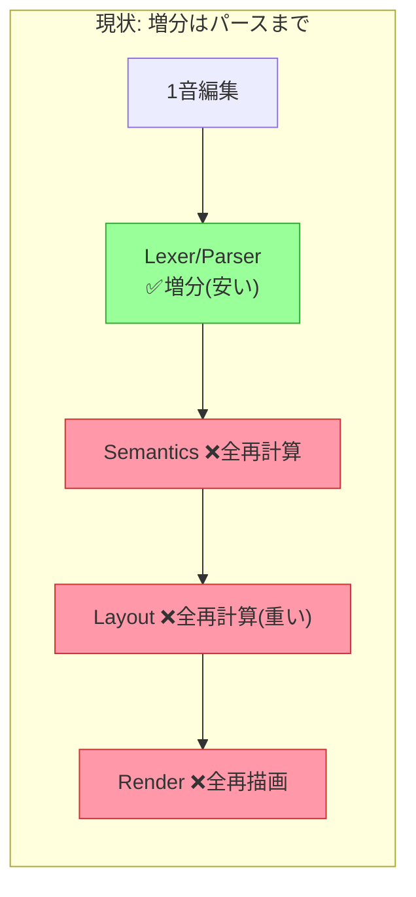
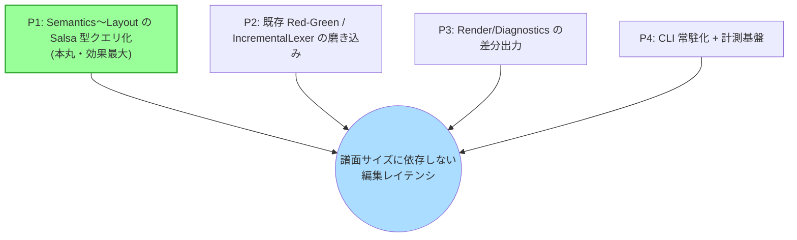
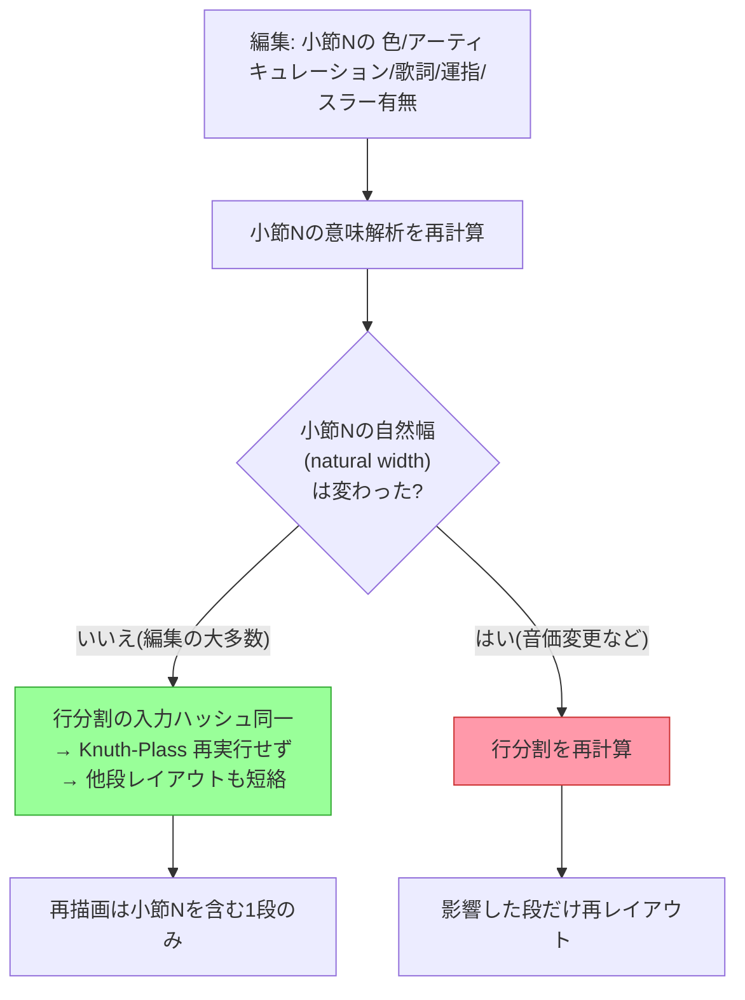
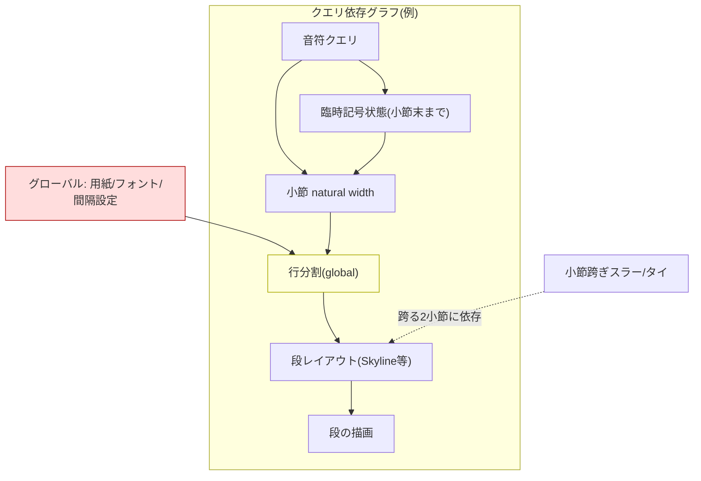
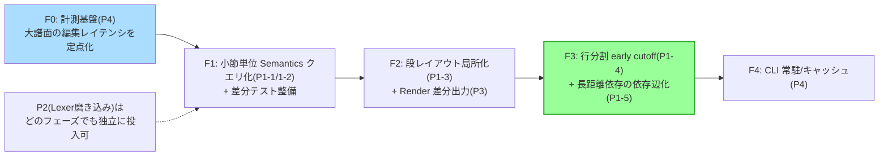

# Lily# 増分コンパイル（Red-Green / LSP）改善提案

> 作成日: 2026-06-29
> 性質: 設計提案。コードは未編集。**別セッションが編集中のため、各提案は着手前に現行コードで前提を再確認すること。**
> 関連: `RELEASE_BLOCKERS.md` / `AI_POSITIONING_HANDOFF.md` / `C:\MyProj\lilypond-vs-lilysharp-code-quality.md`

---

## 0. 現状認識（出発点）

Lily# の増分性は **構文木（パース）層まで**で止まっている。

| 層 | 増分化 | 構成要素（要確認） |
|---|---|---|
| Lexer | ✅ | `IncrementalLexer`（damage 位置から re-enter） |
| Parser / 構文木 | ✅ | Green/Red tree, `SyntaxTree.WithChanges()`, `IncrementalReuseMap` |
| Semantics | ❌ | `DurationCalculator` / `MeasureValidator` / 臨時記号解決 — 毎回フル |
| Model 化 | ❌ | `MeasureCollector` — 毎回フル |
| **Layout（最重量）** | ❌ | 行分割 / Skyline / Beam量子化 / Spacing（91ファイル） — 毎回フル |
| Render | ❌ | `SharedRenderer` → SVG — 毎回フル |

**問題の本質**: CPU を最も食うのは Layout 層。増分パースは「安い部分」しか救っていない。1音編集でも下流が全部走るため、**譜面が大きくなるほど編集→プレビューが重くなる**。

### CLI について
現状の一発実行 CLI は増分の恩恵ゼロ（前回状態が無い）。**原理的不可能ではない**:
- `--watch` / 常駐コンパイルサーバ（状態をメモリ保持）→ LSP と同じ恩恵
- 緑木・レイアウト結果の**ディスクキャッシュ**（content-addressed）→ 実行間で再利用
詳細は P4。

---

## 1. 提案の全体像

優先度: **P1 が最重要**（レイアウトの局所化）。P2 は低コストで堅牢性向上。P3 はクライアント体感、P4 は CLI 拡張と裏付け。

---

## P1 — Semantics〜Layout の Salsa 型クエリ化（本丸）

「コンパイルをクエリ（純関数）の集合として定義し、結果をメモ化、入力変化に応じて連鎖無効化」する。**Lily# は Green ノードが不変・位置非依存ゆえ、そのまま安定したメモ化キーになる**＝適性が高い。

### P1-1. 小節単位の意味解析クエリ
- 単位 = 小節（または拍）。`duration計算`・`小節検証`・`臨時記号解決` をクエリ化。
- キー = 「その小節の Green 部分木」。小節 N 編集 → 小節 N のクエリだけ無効化。

### P1-2. 局所描画プリミティブのメモ化
- 符頭グリフ・符尾・旗・臨時記号グリフ・加線・**ビーム傾き採点（高コスト）** を、局所文脈の純関数としてキャッシュ。

### P1-3. システム（段）単位レイアウトの局所化
- Skyline 衝突・縦間隔・小節内横スペーシングを「段」単位で。内容/改行が変わった段だけ再計算。

### P1-4. 行分割（Knuth-Plass）＋ early cutoff ★最重要トリック
グローバルで局所化できないが、Salsa の **early cutoff（入力を再計算しても出力が同じなら下流を走らせない）** で救う。

- 肝: **幅を変えない編集が大多数**なので、重いグローバル行分割を**ほとんどの編集でスキップ**できる。

### P1-5. 長距離依存を「依存辺」として明示 ★最大の実装リスク
音楽特有の長距離依存をクエリ依存として張らないと**誤出力**になる。最低限カバー:
- 臨時記号は小節末まで効く（小節内の後続音への依存）
- 調 / 音部 / オッターヴァ / 強弱スパンの有効範囲
- 小節跨ぎのスラー・タイ
- クロススタッフ要素
- **グローバル入力**（用紙サイズ・フォント・スペーシング設定）もクエリ入力に登録（変更時は全無効化が正しい）

### P1-6. 期待効果
- 大譜面の LSP ライブプレビューが「小節N + その段 + (多くは)行分割スキップ + 1段再描画」になり、**譜面サイズに依存しない応答**へ。
- 人間タイプ／エージェントの「書く→診断→直す」ループが、譜面が育っても軽快なまま。
- 副次: 独立段の**並列レイアウト**が容易（依存グラフが独立性を明示）。

---

## P2 — 既存 Red-Green / IncrementalLexer の磨き込み（低コスト・堅牢性）

P1 ほど大きくないが安価で効く。

- **damage 範囲の最小化**: 編集が触る最小トークン/ノード範囲をタイトに算出（広すぎる再パースを削る）。
- **再利用粒度の拡大**: `IncrementalReuseMap` がトップレベルノード採用なら、より細かい部分木再利用へ（要現状確認）。
- **Lexer re-entry の境界正しさ**: 複数文字トークン（`|:` `:|` `<<` `>>` `--` `__` `R1*N`）を跨ぐ編集で、lookback/lookahead が壊れないことをテスト網羅。
- **構文木の不変条件の強制**: Green の位置非依存をアサートで担保（P1 のメモ化キー安全性の前提）。

---

## P3 — Render / Diagnostics の差分出力（クライアント体感）

- **部分 SVG 更新**: 変わった段だけを再シリアライズしてクライアントへ送る（全 SVG 再送をやめる）。プレビュー更新の体感が向上。
- **診断の増分 publish**: 変更小節由来の診断だけ差し替え。
- いずれも P1 の「どの段/小節が変わったか」情報を前提に成立。

---

## P4 — CLI 常駐化と計測基盤

- **`--watch` / コンパイルサーバ**: 状態をメモリ保持し、ファイル変更で増分再コンパイル → CLI でも P1 の恩恵。
- **ディスクキャッシュ（content-addressed）**: 緑木・小節レイアウト結果を実行間で再利用。一発実行 CLI でも2回目以降が速くなる。
- **計測**: 大譜面での「1編集あたり再コンパイル時間」「コールド単発時間」を BenchmarkDotNet（既存資産）で定点観測し、改善を数値で裏取り。

---

## 2. リスクと前提（正直に）

- **隠れ入力の取りこぼし = 正しさ崩壊**。レイアウトの全入力（グローバル設定含む）をクエリ入力に登録しないと、設定変更時に古いキャッシュが残る。
- **長距離依存の張り忘れ = 誤出力**（P1-5）。Red-Green パース増分化より難度が高い。**「増分結果 == フル計算結果」の差分テスト**を必須にする。
- **メモリ**: 段/小節ごとの結果保持で消費増。LRU 等の退避と上限予算が要る。
- **段階導入が前提**。一括移行は危険。

---

## 3. 推奨フェーズ

- **F0 を最初に**（改善を数値で証明できる状態を先に作る＝品質を「実証」へ）。
- **F1 で差分テストを敷設**してから下流へ（正しさの安全網を先に張る）。
- **F3 が効果のヤマ**（重いレイアウトの局所化＋行分割スキップ）。

---

## 4. 一行まとめ

> Red-Green が救ったのは安いパース層。**Salsa 型クエリ化を Semantics〜Layout に入れ、重いレイアウトを「変わった小節＋その段」に局所化し、early cutoff でグローバル行分割を大多数の編集でスキップする**のが本丸。Lily# は Green の不変・位置非依存ゆえメモ化キーの素地が既にあり適性が高い。成否は**音楽の長距離依存を依存グラフへ正しく落とせるか**にかかる。
