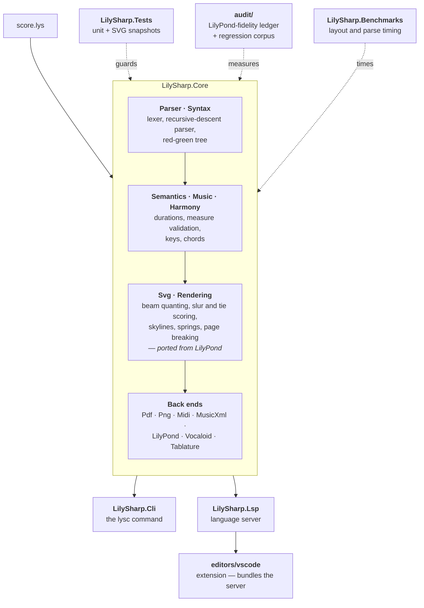

# Lily#

A music notation language and engraving engine — publication-quality sheet music
from plain text, with an IDE-first toolchain.

[](https://github.com/yotsuda/LilySharp/actions/workflows/ci.yml)
[](https://marketplace.visualstudio.com/items?itemName=yotsuda.lilysharp)
[](LICENSE)

## Overview

Lily# compiles a `.lys` source file to engraved sheet music (SVG, PDF, PNG), and to
MIDI, MusicXML, LilyPond source and VOCALOID sequences. It engraves staff notation,
guitar tablature and staff-less lead sheets from the same source.

Its layout engine is in part a **port of LilyPond**, the GNU music typesetter: beam
quanting, slur and tie scoring, skylines, springs and page breaking are modified
translations of LilyPond's own algorithms rather than independent approximations.
See [Relationship to LilyPond](#relationship-to-lilypond).

The language, by contrast, is deliberately not LilyPond's. It is designed for:
- **Explicit over implicit**: Clear, readable syntax
- **Completion-friendly**: IDE-first design with full LSP support
- **Single-pass incremental compilation**: Using Roslyn-style Red-Green tree pattern

## Project Structure

One library does the work; everything else is a front end onto it or a net under it.



The engraving engine is `LilySharp.Core/Svg/` and `LilySharp.Core/Rendering/` — that is
where the LilyPond port lives, and where most of the code is.

Alongside the code:

| Path | What it holds |
|------|---------------|
| [`samples/`](samples/) | Complete public-domain pieces — see [samples/README.md](samples/README.md) |
| [`audit/`](audit/) | The LilyPond-fidelity ledger and the regression corpus |
| [`docs/GRAMMAR_FOR_LLM.md`](docs/GRAMMAR_FOR_LLM.md) | Canonical single-file spec |
| [`docs/GRAMMAR.md`](docs/GRAMMAR.md) | Formal EBNF |
| [`docs/SYNTAX_REFERENCE.md`](docs/SYNTAX_REFERENCE.md) | Browsable reference |
| [`docs/TUTORIAL.md`](docs/TUTORIAL.md) | Getting started |

[CHANGELOG.md](CHANGELOG.md) records what changed between releases.

## Language Features

### Basic Syntax

```lilysharp
// Comments
title "Happy Birthday"
composer "Traditional"
tempo 120
time 3/4
key g major

part melody { clef treble }       // declare each part; clef lives here
section Main { melody { c4 d e | g2. | } }
form main { Main }                // print/playback order of sections
score main "out" { staff melody }      // one or more render blocks
```

> Lily# is **not** LilyPond: `\relative`, `<< … \\ … >>`, `\new Staff`, `\version`
> and other backslash constructs are rejected. The compressed grammar in
> [`docs/GRAMMAR_FOR_LLM.md`](docs/GRAMMAR_FOR_LLM.md) is the canonical single-file spec.

### Pitch Names

Standard pitch names with accidentals:
- `c`, `d`, `e`, `f`, `g`, `a`, `b`
- Sharp: `cis`, `dis`, `fis`, etc.
- Flat: `des`, `ees`, `bes`, etc.
- Double: `cisis`, `deses`, etc.

### Durations

- `1` = whole, `2` = half, `4` = quarter, `8` = eighth, etc.
- Dots: `4.` = dotted quarter, `4..` = double-dotted

### Octave Marks

- `c'` = one octave up
- `c''` = two octaves up
- `c,` = one octave down

By default each bare pitch takes the octave nearest the previous note (an interval of a
fourth or less), and `'`/`,` shift from there.

**`octave absolute`** switches that off: bare `c` is always C4, and `'`/`,` are absolute
offsets from it (`c'` = C5, `c,` = C3), resolved independently per note. A wrong octave
then stays one wrong note instead of cascading through everything after it — which is why
it is the recommended mode when a tool, or a person, writes notes it cannot immediately
hear. Write it at the top level, in a part header, or mid-music; `part bass { octave 3 }`
re-anchors a low part so commas do not pile up.

```lilysharp
octave absolute

part melody { clef treble }
part bass   { clef bass octave 3 }   // bare c = C3 in this part
```

Every file in [`samples/`](samples/) uses it.

### Articulations and Dynamics

```lilysharp
c4@staccato d@accent e@fermata f@tenuto
c4@p d@f e@ff f@mf
```

### Tuplets

```lilysharp
tuplet 3/2 { c8 d e }  // Triplet
tuplet 5/4 { c16 d e f g }  // Quintuplet
```

### Grace Notes

```lilysharp
grace { c16 d } e4  // Grace notes before e
```

### Slurs (notes or chords)

```lilysharp
c4( d e f)          // slur over single notes
<c e>4( <d f>)      // a slur can bind chords too
```

### Lyrics

Lyrics live inside a section and align to that part's notes; `-` joins syllables of
one word and `|` mirrors the music's barlines.

```lilysharp
part melody { clef treble }

section Main {
    melody { c4 d e f | g2 g | }
    lyrics words sings melody { Hap- py birth- day | to you | }
}
form main { Main }
score main { staff melody  lyrics words }   // the row below the staff is its verse
```

### Lead sheets (chords and/or lyrics, no staff)

A `chords NAME { … }` and/or `lyrics NAME { … }` part, placed in a `score` with
`chords NAME` / `lyrics NAME` (instead of `staff NAME`), renders without a staff: a
grid of measure barlines with the chord symbols between them (at their timing) and
the lyrics below. A chord entry is written the way it prints — an UPPERCASE root,
`#`/`b`, a bare quality (`C`, `Am`, `G7`, `F#m`, `Bb7/D`) — and it places itself on the
bar's beat grid rather than carrying a duration: one entry takes the bar, two in 4/4 are
halves, and `.` holds the previous chord one more beat.

```lilysharp
section Main {
    chords prog  { C G7 | Am F | C | }
    lyrics words { Twin- kle | lit- tle | star | }
}
form main { Main }
score main "sheet" { chords prog lyrics words }
```

### Repeats and Alternatives

Volta repeats use the symbolic `|: … :|` barlines — **written in the `form`, not in the
music**. A repeat changes the ORDER the music plays in, and the form is where a book's
order lives, so the bars that repeat go in a `section` of their own and the form repeats
the section. Volta endings are `[1. Section] [2. Section]`; the repeat count defaults to
2 (or the number of endings), or state it explicitly with `|: … :|*N`.

```lilysharp
part melody { clef treble }

section Body   { melody { c4 d e f | } }
section First  { melody { g2 g | } }        // first time
section Second { melody { a2 a | } }        // second time

form main { |: Body [1. ~First] :| [2. ~Second] }

score main { staff melody }
```

A plain `form main { |: Body :| }` (no endings) just repeats its body, and a third or
later ending is written the same way: `:| [3. Third]`. A repeat bar or a volta ending
written in the music is refused with `LYS1034`.

(The `repeat` keyword remains for `unfold` / `percent` / `tremolo`, which abbreviate
notes rather than change the playing order, and so stay in the music.)

### Parallel Voices (one staff)

```lilysharp
voice { c'2 d } { e2 f }   // `voice` opens the span ONCE; each further { } is another voice
```

### Named music (phrases)

Named music is declared with `phrase` and referenced by its bare name:

```lilysharp
phrase motif { c4 d e f }

part melody { clef treble }
section Main { melody { motif g2 g | } }
form main { Main }
score main "out" { staff melody }
```

### Staves and groups

A `score` is a vertical stack of bands: each item is a row, and what a row means comes
from its order, not from a clause attached to it. Several staves can be bracketed together:

| Item | Left edge | Bar lines between staves | Pick it for |
|------|-----------|--------------------------|-------------|
| `grandStaff` | brace | drawn through | one instrument on two staves (piano, harp) |
| `staffGroup` | bracket | drawn through | one family (the woodwinds) |
| `choirStaff` | bracket | **not** drawn through | independent lines (voices) |

```lilysharp
score choral "satb" { choirStaff { staff sop  staff alt  staff ten  staff bas } }
```

Two more put several parts on ONE staff: `condensedStaff { fl1 fl2 }` gives each part its
own voice, and `combinedStaff { fl1 fl2 }` merges them the way an orchestral score
condenses two players — unisons become one notehead marked `a2`, a lone part is marked
`Solo`. Both take bare part names, and both are score items, so one source can print the
condensed score and the separate parts.

A staff can also change its line count where it is rendered — `staff comp as lines 1` is a
one-line rhythm staff for slash notation (`/4 4 4 4`), while the same part keeps five lines
in the full score.

### Guitar tablature

A part with a `tuning` renders as tablature with `tab NAME`, next to ordinary notation or
on its own:

```lilysharp
part gt { clef treble_8 tuning guitar }

section Main { gt { c'4 e' g' e' | } }
form main { Main }

score main "guitar" {
  staff gt        // the notation
  tab gt          // the tablature under it
}
```

A tab standing beside a staff prints fret numbers only — the staff above it already carries
the meter, stems and beams. A tab on its own carries all of that itself. Say which you want
with `tab gt as numbers` / `tab gt as full`. `\3` pins a note to a string when the
automatic choice is not the one your fingers want.

### More of the language

Not shown above, all in [`docs/GRAMMAR_FOR_LLM.md`](docs/GRAMMAR_FOR_LLM.md):

- **Page and type** — `paper { … }` for page size, margins and vertical spacing;
  `fonts { … }` to bind text faces per role, both also as named blocks used per score
- **Spanners** — ottava (`@ottava` … `@!ottava`), pedals (`@sustain` … `@!sustain`),
  text spanners (`@rit` / `@accel`), trill spanners, hairpins
- **Cue notes** — `cue { … }`, optionally read in another instrument's clef
- **Arpeggios** — `<< c e g >>` writes a broken chord out; `@arpeggio` rolls a chord
- **Scale degrees** — `<c 3 5>` and `<1 3 5>` spell chords by degree instead of by letter
- **Transposing instruments**, percussion staves and `drummap`
- **Multi-file sources** — `using "other.lys"`

## Install

### VS Code extension (recommended)

Open the Extensions view (`Ctrl+Shift+X` / `Cmd+Shift+X`), search for **Lily#**, and
install `yotsuda.lilysharp` — or go straight to the
[Marketplace listing](https://marketplace.visualstudio.com/items?itemName=yotsuda.lilysharp).
Then open any `.lys` file: you get diagnostics as you type, completion, and a live
score preview beside the source.

Nothing else to install — each platform's package bundles its own .NET runtime, and
VS Code picks the one for your machine. See
[editors/vscode/README.md](editors/vscode/README.md) for settings and troubleshooting.

### CLI (`lysc`)

Only needed for batch work and scripting — the extension does not require it.
Download the archive for your platform from
[Releases](https://github.com/yotsuda/LilySharp/releases), unpack it, and put `lysc`
on your `PATH`. Self-contained as well: the runtime and the fonts ship inside.

## Usage

```bash
lysc svg samples/fur-elise.lys          # engrave -> fur-elise.svg
lysc pdf samples/greensleeves.lys       # -> greensleeves.pdf
lysc png samples/amazing-grace.lys      # -> amazing-grace.png
lysc midi samples/canon-in-d.lys        # -> canon-in-d.mid
lysc check samples/drunken-sailor.lys   # syntax check only, no output file

lysc svg score.lys out.svg              # name the output file
lysc --help                             # every command
lysc svg --help                         # options for one command
```

| Command | Output |
|---------|--------|
| `svg` `pdf` `png` | Engraved sheet music |
| `midi` | MIDI, with dynamics and articulations |
| `xml` | MusicXML |
| `ly` | LilyPond source |
| `vsqx` | VOCALOID sequence (vocal part + lyrics) |
| `import` | MusicXML → Lily# source |
| `harmonize` | Suggests a diatonic chord track for a melody |
| `check` | Syntax check, no output |
| `layout` | Text summary of system and line breaks |

[`samples/`](samples/) holds five complete public-domain pieces, plus a two-bar manual
beaming demo — see [samples/README.md](samples/README.md) for what each one demonstrates.

## Building from source

### Requirements

- .NET 10 SDK
- Node.js (for the VS Code extension)

### Build

```bash
dotnet build LilySharp.slnx
dotnet test  LilySharp.Tests/LilySharp.Tests.csproj
```

Run the CLI without installing it:

```bash
dotnet run --project LilySharp.Cli -- svg samples/fur-elise.lys
```

### Run the LSP server

```bash
dotnet run --project LilySharp.Lsp
```

### Build the VS Code extension

```bash
cd editors/vscode
npm install
npm run compile
```

## VS Code Features

The VS Code extension provides comprehensive language support:

| Feature | Description |
|---------|-------------|
| **Diagnostics** | Real-time error and warning display |
| **Completion** | Auto-complete for keywords, pitches, dynamics |
| **Hover** | Information on hover for syntax elements |
| **Document Symbols** | Outline view with score structure |
| **Go to Definition** | Navigate to variable declarations |
| **Find References** | Find all uses of a variable |
| **Semantic Highlighting** | Syntax-aware coloring for pitches, dynamics |
| **Folding** | Collapse music blocks and structures |
| **Rename** | Rename variables across the document |
| **Formatting** | Auto-format document |
| **Code Actions** | Quick fixes and refactoring |
| **Signature Help** | Parameter hints for keywords |
| **Document Highlight** | Highlight variable references |

## Compilation Architecture

### Red-Green Tree Pattern

Lily# uses the Roslyn-style Red-Green tree pattern for efficient incremental compilation:

- **Green Nodes**: Immutable, position-independent syntax nodes
- **Red Nodes**: Lazily created wrappers with position information
- **Incremental Updates**: Only affected portions are re-parsed

### Single-Pass Compilation

The compiler performs lexing and parsing in a single pass:
1. Lexer tokenizes source text
2. Parser builds green tree
3. Red nodes created on-demand
4. Semantic analysis validates structure

### Incremental Sync

The LSP server supports incremental text synchronization:
- `TextChange` API for partial updates
- `SyntaxTree.WithChanges()` for efficient re-parsing

## Status

### Implemented

- [x] Lexer with all token types
- [x] Recursive descent parser
- [x] Red-Green tree architecture
- [x] Incremental parsing with TextChange API
- [x] Duration calculation
- [x] Measure validation
- [x] MIDI export with dynamics and articulations
- [x] Full LSP support (13+ features)
- [x] VS Code extension with semantic highlighting
- [x] Key signatures, clefs, tuplets
- [x] Grace notes
- [x] Lyrics support
- [x] SVG music engraving (Emmentaler font, beams, ties, slurs — including slurs over chords, tuplets, volta brackets, multi-measure rests)
- [x] Multi-system layout with Knuth-Plass line breaking
- [x] Multi-staff / GrandStaff rendering (cross-staff beam layout is not yet implemented)
- [x] Lead sheets — staff-less chord rows and lyric rows drawn as a measure grid (chords, lyrics, or both)
- [x] Guitar tablature — beside a notation staff or on its own, with per-note string pinning
- [x] Paper and font blocks (`paper { … }`, `fonts { … }`), per file or per score
- [x] MusicXML export (notes, ties, slurs, grace notes, dynamics, articulations, ornaments, multi-part, lyrics, tuplets, navigation marks, volta endings) — custom text marks written in a `form` are not yet mapped
- [x] MusicXML import (`lysc import`)
- [x] LilyPond (`.ly`) export
- [x] VOCALOID (`.vsqx`) export — vocal part with lyrics
- [x] Multi-file sources — `using "other.lys"`, depth-first and de-duplicated
- [x] CLI tool (`lysc`) — SVG / PDF / PNG / MIDI / MusicXML / LilyPond / VOCALOID, plus `check`, `layout` and `harmonize`

### Planned

- [ ] Cross-staff beam layout
- [ ] LilyPond → Lily# conversion tool

## Relationship to LilyPond

Lily# is an independent project. It is **not** affiliated with, endorsed by, or a
release of the LilyPond project, and its language is deliberately not LilyPond's.

Its engraving engine, however, is in part a **port of LilyPond**, the GNU music
typesetter: beam quanting, slur and tie scoring, skylines, springs, page breaking
and other layout algorithms are modified translations of LilyPond's C++ and Scheme
rather than independent implementations. Those files carry the copyright notices of
the LilyPond files they were ported from, and
[LILYPOND-ATTRIBUTION.md](LILYPOND-ATTRIBUTION.md) lists every one of them.

Most `LILYPOND-REF` comments elsewhere in the source are citations rather than
ports: they record where LilyPond decides something so that Lily#'s own code can be
checked against it.

## Contributing

Bug reports and patches are welcome — see [CONTRIBUTING.md](CONTRIBUTING.md).

⚠️ Two rules there are not the usual boilerplate and decide whether an engraving
patch can be merged: layout code is transliterated from LilyPond's source rather
than measured off its output, and nothing may be engineered to keep the output
byte-identical. Please read that section before writing layout code.

## License

Copyright (C) 2025-2026 Yoshifumi Tsuda &lt;ytsuda@gmail.com&gt;.

This program is free software: you can redistribute it and/or modify it under the
terms of the [GNU General Public License v3.0](LICENSE) or later. It contains
modified code from LilyPond, which is under the same licence; the modifications are
Lily#'s and are marked in the files that carry them.

The per-file headers name the copyright holder without an address; this line is the
one place the address is kept, so it stays correct if it ever changes.

**Source for the binaries.** The CLI archives and the VS Code extension are built
from this repository. The complete corresponding source for any released binary is
the tagged commit it was built from, available at
<https://github.com/yotsuda/LilySharp>.

## Acknowledgments

- LilyPond — the engraving algorithms this engine ports, and the reference its
  output is measured against
- Roslyn for the Red-Green tree pattern
- Emmentaler font (from LilyPond; GPL-3.0-or-later / SIL OFL dual license, redistributed here under the GPL) — music glyphs; see `LilySharp.Core/Fonts/Emmentaler-LICENSE.txt`
- TeX Gyre Schola / TeX Gyre Heros fonts (GUST Font License, i.e. LPPL 1.3c) — all non-music text, and the metrics the engine spaces it by; the same faces LilyPond sets text in. See `LilySharp.Core/Fonts/TeXGyre-LICENSE.GUST.txt`